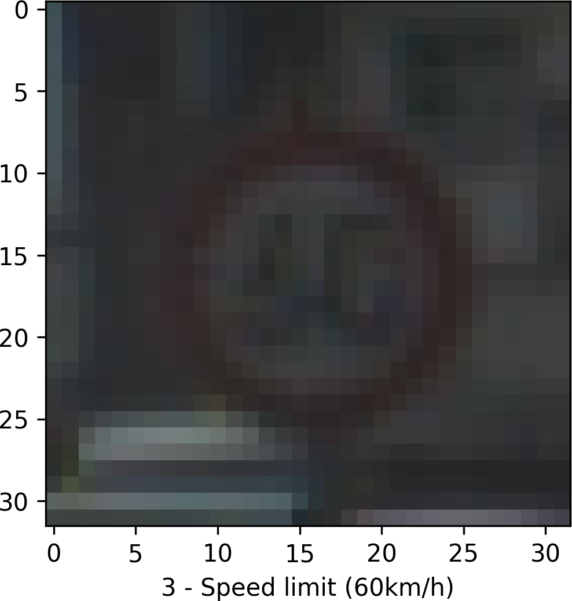

# Traffic Sign Recognition / Classification Project 

**Build a Traffic Sign Recognition Project**

The goals / steps of this project are the following:
* Load the data set (https://d17h27t6h515a5.cloudfront.net/topher/2017/February/5898cd6f_traffic-signs-data/traffic-signs-data.zip)
* Explore, summarize and visualize the data set
* Design, train and test a model architecture
* Use the model to make predictions on new images
* Analyze the softmax probabilities of the new images
* Summarize the results with a written report
* Optionally, visualize the features of the network on an image

## Rubric Points
Here I will consider the [rubric points](https://review.udacity.com/#!/rubrics/481/view) individually and describe how I addressed each point in my implementation.  

---
## Writeup / README

You're reading it! and here is a link to my [project code](https://github.com/SagarmathaTech/jad-carnd-p2-traffic-sign-classifier/blob/master/Traffic_Sign_Classifier.ipynb)

### Data Set Summary & Exploration

First, I used the basic properties provided by the Numpy library to output summary statistics of the traffic signs data set:

* The size of training set is 34,799
* The size of the validation set is 4,410
* The size of test set is 12,630
* The shape of a traffic sign image is (32, 32, 3)
* The number of unique classes/labels in the data set is 43

Second, I used the cvs library to load the class IDs and their associated sign names from the signnames.cxv file.

Thrid, I used the Matplot library to chart a random sampling of the training images as follows:

&nbsp;&nbsp;&nbsp;&nbsp;&nbsp;&nbsp; 
&nbsp;&nbsp;&nbsp;&nbsp;&nbsp;&nbsp; 
&nbsp;&nbsp;&nbsp;&nbsp;&nbsp;&nbsp;

Fourth, I used the Matplot library to do an exploratory visualization of the data set. It is a bar chart showing how the datasets compare to each other and how the number of examples for each class compares. For example, Speed Limit classes have many more training examples than the Dangerous Curve classes.

### Design and Test a Model Architecture

As a first step, I decided to convert the images to grayscale because I wanted to limit the network to focusing on shapes and not colors to reduce complexity. I will say, this may have hurt my networks performance in the long run as you will see later when it generalizes against new images, for example, a new example of a Traffic Lights sign. I believe the colors could add additional value to the network to further limit false predictions; however, I have not tested this theory yet.

Here is an example of a traffic sign image before and after grayscaling.

&nbsp;&nbsp;&nbsp;

As a second setup, I augmented the data by taking the grayscaled training data set and adding 100% of the copies for each of the following forms:

* Transpose/Flip Horizontally
* Transpose/Flip Vertically
* Random zooming in of the image
* Rotation of image 15 degrees
* Rotation of image -30 degrees

Here is an example of an original image and an augmented image:

&nbsp;&nbsp;&nbsp;

As a last step, I normalized the image data because ...

The difference between the original data set and the augmented data set is the augmented data set is 6 times larger than the original, it is graysacled, and normalized between -1 and 1.

My final model consisted of the following layers:

| Layer         		|     Description	        					| 
|:---------------------:|:---------------------------------------------:| 
| Input         		| 32x32x1 Grayscale image						| 
| Convolution 5x5     	| 1x1 stride, same padding, outputs 28x28x16 	|
| ReLU					|												|
| Max pooling	      	| 2x2 stride, outputs 14x14z16  				|
| Convolution 3x3	    | 1x1 stride, same padding, outputs 14x14x32	|
| ReLU		            |            									|
| Max pooling			| 2x2 stride, outputs 7x7x32    				|
| Convolution 1x1		| 1x1 stride, same padding, outputs 7x7x64		|
| ReLU					|												|
| Max pooling           | 2x2 stride, outputs 4x4x64                    |
| Flatten               | outputs 1024                                  |
| Fully connected       | outputs 120                                   |
| ReLU                  |                                               |
| Dropout               |                                               |
| Fully connected       | outputs 84                                    |
| ReLU                  |                                               |
| Dropout               |                                               |
| Fully connected       | outputs 43 (number of classes)                |
| Soft max              |                                               |
| Reduce mean           |                                               |
| ADAM optimizer        |                                               |

To train the model, I used the ADAM optimizer, with a batch size of 128, a learning rate of 0.0001, a dropout of 0.65, and 100 epochs.

My final model results were:
* training set accuracy of 95.9%
* validation set accuracy of 93.0%
* test set accuracy of 92.8%

I start out mimicing the LeNet model from the class lesson on CNNs. I most definitely took an iterative approach to designing the network model and choosing the parameters and hyperparameters. At the beginning, I was very unsure as to what I should change to get closer to the desired accuracy so I spent a lot of time trying many different options (I spent way too much time training, tweeking, and optimizing the network - over 200 hours and I'll speak more to this in the last section).

My first architecture was the basic LeNet model from the lesson; however, I flattened the data to grayscale images and updated the model accordingly. Unfortunately, I could not get the validation accuracy past 80% even though it was mentioned in the forums that I should be able to get 95% with the basic LeNet model. What I may have missed early on was my reluctance to lower the learning rate past 0.001, and, instead, changed batch size and the number of epochs.

Once I gave up on the initial model, I started thinking about increasing the training data, which led to the question of what might help with new images the network hasn't seen. I added horizontal and verticle flips, though these probably aren't real world examples a network would see on the road and may have caused more issues than they solved, randomly zoomed in on the images keeping the original image size (cropping), various rotations of the images (30, 60, 150, 240, 300, 330). The last item I wanted to add was a version of the images that would be skewed to appear to be viewed at an inward angle but couldn't find an implementation of how to achieve this.

As I was training the model with this new data, I received better results; however, I still could not get above approximately 88% no matter how long I ran the network. After asking some questions and reviews of the forum posts, I finally allowed myself to reduce the learning rate to 0.0001. This achieved better results but now my network was learning too fast; therefore, I added dropout to the model.

After adding dropout, I now had to balance varying parameters (keep probability, epochs, batch size) and spent quite a bit of time training with various combinations of parameters. I was getting no where fast so I reviewed the forms some more and came up adding plots for my loss and accuracy across both training and validation so I could better visualize what the network was doing.

Seeing how the network was learning gave me some insight and I started adding more layers to the model to attempt to get more fine-grained on the images (more layers, changing from VALID to SAME - back-and-forth).

I finally got to a point where I was getting around 96% validation accuracy with approximately 94% training accuracy and, I thought this was good enough. The model achieved about 92.8% accuracy on the test set; however, once I gave it new images from the internet, I was lucky to get 50% accuracy.

I then moved on to visualizing the network's state (features) and, once I was able to see the visualizations, it appears the extra layers didn't provide any benefit. In all honesty, I'm not 100% sure my assumption is correct since what I see in the visualizations may not be what the network understands from the math.

### Test a Model on New Images

To try to provide a better accuracy for the prediction of new images, I chose 21 images of German traffic signs from the web:

&nbsp;&nbsp;&nbsp;&nbsp;&nbsp;&nbsp; 
&nbsp;&nbsp;&nbsp;&nbsp;&nbsp;&nbsp; 
&nbsp;&nbsp;&nbsp;&nbsp;&nbsp;&nbsp; 
&nbsp;&nbsp;&nbsp;&nbsp;&nbsp;&nbsp; 
&nbsp;&nbsp;&nbsp;&nbsp;&nbsp;&nbsp; 
&nbsp;&nbsp;&nbsp;&nbsp;&nbsp;&nbsp;

The seventeenth image, Traffic Signals, might be difficult to classify because it is very similar to the Yield sign and the 3 dots may be seen as a vertical line like that in the Yield sign.

Here are the results of the prediction:

| Image			          |     Prediction	        					  | 
|:-----------------------:|:---------------------------------------------:| 
| Speed Limit - 30 km/h   | Speed Limit (30 km/h)						  | 
| Speed Limit - 120 km/h  | Speed Limit (70 km/h)						  |
| Ahead Only			  | Ahead Only									  |
| Bicycles Crossing		  | Bicycles crossing			 			 	  |
| Bumpy Road			  | Bumpy Road      							  |
| Children Crossing       | Children crossing                             |
| Dangerous Cruve To Left | Dangerous curve to left                       |
| Double Curve            | Double Curve                                  |
| General Caution         | General Caution                               |
| Go Straight Or Right    | Go straight or right                          |
| No Entry                | No Entry                                      |
| No Passing              | End of Speed Limit (80 km/h)                  |
| Pedestrian Crossing     | Road Work                                     |
| Pedestrians Only        | Ahead Only                                    |
| Road Slippery           | Road Slippery                                 |
| Road Work               | Road Work                                     |
| Roundabout              | Priority Road                                 |
| Stop                    | Stop                                          |
| Traffic Signals Ahead   | Dangerous curve to the left                   |
| Wild Animals Crossing   | Double curve                                  |
| Yield                   | Yield                                         |

The model was able to correctly guess 14 of the 21 traffic signs, which gives an accuracy of 66.7%. This compares unfavorably to the accuracy on the test set of 92.8%.

The code for making predictions on my final model is located in the 31st cell of the Ipython notebook. I'll provide probablity information for the first 5 images.

For the first image, the model is definitely sure this is a speed limit (30 km/h) sign (probability of 0.996), and the image does contain a speed limit (30 km/h) sign. The top five soft max probabilities were:

| Probability         	|     Prediction	        					| 
|:---------------------:|:---------------------------------------------:| 
| .97839       			| Speed Limit (30 km/h)							| 
| .00206   				| Speed Limit (70 km/h)							|
| .00035				| Speed Limit (20 km/h)							|
| .00018      			| Speed Limit (50 km/h) 		 				|
| .00001			    | Speed Limit (60 km/h)							|

For the second image, the model does not know the sign is a speed limit (120 km/h) sign at all. The model strongly believes the sign is a speed limit (70 km/h) sign. The top five soft max probabilities were: 

| Probability         	|     Prediction	        					| 
|:---------------------:|:---------------------------------------------:| 
| .83647       			| Speed Limit (70 km/h)							| 
| .10531   				| Speed Limit (60 km/h)							|
| .03502				| Speed Limit (30 km/h)							|
| .01306      			| Stop                   		 				|
| .00826			    | No vehicles       							|

For the third image, the model definitely knows the sign is an ahead only sign and the images does contain an ahead only sign. The top five soft max probabilities were: 

| Probability         	|     Prediction	        					| 
|:---------------------:|:---------------------------------------------:| 
| 1.0       			| Ahead Only        							| 
| 0.0 (too small)		| Turn Right Ahead  							|
| 0.0 (too small)		| Turn Left Ahead   							|
| 0.0 (too small)		| Speed Limit (60 km/h)    		 				|
| 0.0 (too small)	    | Keep Right           							|

For the fourth image, the model definitely knows the sign is a bicycles crossing sign and the images does contain a bicycles crossing sign. The top five soft max probabilities were: 

| Probability         	|     Prediction	        					| 
|:---------------------:|:---------------------------------------------:| 
| 0.9565       			| Bicycles Crossing    							| 
| 0.0255        		| Priority Road      							|
| 0.0131        		| Children Crossing   							|
| 0.0024        		| Speed Limit (100 km/h)   		 				|
| 0.0021        	    | Speed Limit (120 km/h)						|

For the third image, the model definitely knows the sign is a bumpy road sign and the images does contain a bumpy road sign. The top five soft max probabilities were: 

| Probability         	|     Prediction	        					| 
|:---------------------:|:---------------------------------------------:| 
| 0.9981       			| Bumpy Road        							| 
| 0.0001        		| Bicycles Crossing  							|
| 0.0             		| Road Work          							|
| 0.0           		| Yield                   		 				|
| 0.0           	    | Turn Left Ahead      							|

### Visualizing the Neural Network

If you look at the features the network finds with the new Traffic Signals image, you'll notice it's finding the triangle, the dots that make up the lights of the traffic signal, but also it's finding a verticle line by connecting the dots of the lights.

Traffic Signal New Sign:

Convolution 1 - 

Convalution 2 - 

Convolution 3 - 

## Reflection and Lessons Learned

I definitely spent many more hours on this project than I ever expected; it was approximately 200 hours of tweeking and running training sessions, easily 10 to 14 hour days for more than 2 weeks. My biggest challenge was learning how the changes in hyperparameters affect the training, what it means to increase the complexity of the model by adding more layers or increasing/decreasing filters, adding dropout to the model, changing the keep probability for dropout, where to perform dropout (no real guidance on this in the course and online, it's all over the spectrum: all hidden layers, only fully connected layers, etc.), etc.

Something I did not expect to see is how drastically the training performance can be affected by something like batch size and how increasing it may slow down the training of the network. This seems counter-intuitive and maybe the reviewer will disagree with this observation but it's what the data showed during my numerous training sessions.

Something else I need to focus on is documenting the model architecture along with the parameters used for training and the resulting statistics. I can't say for sure but I have to imagine I spent wasted time rerunning instances I did not need to but after 20, 30, 40 incarnations, it becomes difficult to remember. Having this documented in an Excel workbook where each spreadsheet is a different architecture and parameters along with results are listed with it would limit this redundacy and bring better insight.

It's also worth noting visualizations should be developed as early as possible. Trying to visualize statistics (loss, accuracy) of your network over 100+ epochs can be difficult. Charting this makes it much easier and clearer. Even using the visualizations of the feature the network is pulling out of your images can be of help early on.

Lastly, it's important to think about the type of augmentations to training data that should be performed. I'm sure some of the augmentations were unnecessary as they would not be seen in the real world and; therefore, may only have confused the network or slowed down the training due to superfluous data. This also brings up the question of why grayscaling was performed? Would the network have been more effective if it was left with the 3 channels of color? Most traffic signs are color specific.